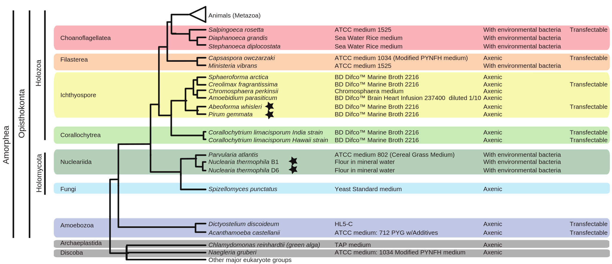

# Spain Beasts

## Date
18.04.22-23.04.22

## Coverage
See [file](./data/wgs_quality.tsv)

## Adapters [link](https://home.hiroshima-u.ac.jp/~tigawa/?p=1154)
Primers for BGISEQ/DNBSEQ/MGISEQ library sequencing: 
All following sequencing primers are included in the sequencing kits of BGISEQ/DNBSEQ/MGISEQ system.
 
Read 1 sequencing primer: 
GCTCACAGAACGACATGGCTACGATCCGACTT 
Barcode SE sequencing primer: 
AAGTCGGAGGCCAAGCGGTCTTAGGAAGACAA 
Read 2 sequencing primer: 
TTGTCTTCCTAAGACCGCTTGGCCTCCGACTT 
Barcode PE sequencing primer: 
ATGTCGTTCTGTGAGCCAAGGAGTTG 

The following sequences are used to filter the adapter contamination in raw data. 
Forward filter: 
AAGTCGGAGGCCAAGCGGTCTTAGGAAGACAA 
Reverse filter: 
AAGTCGGATCGTAGCCATGTCGTTCTGTGAGCCAAGGAGTTG 

## Relatives

## Used software
- [fastqc](https://www.bioinformatics.babraham.ac.uk/projects/download.html#fastqc)
- [muttiqc](https://multiqc.info/)
- [trimmomatic](http://www.usadellab.org/cms/?page=trimmomatic)

	